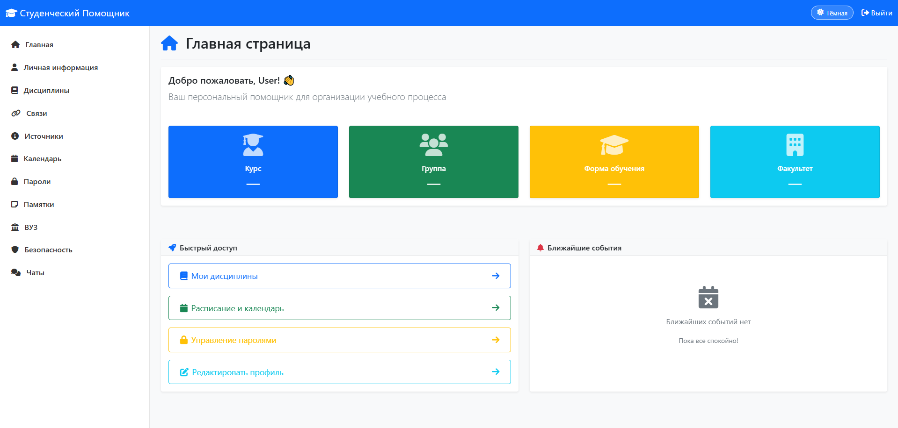
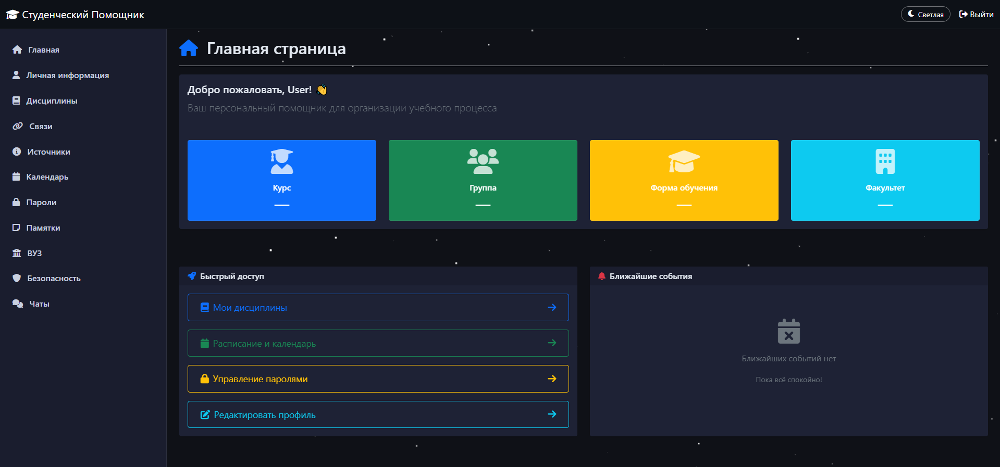
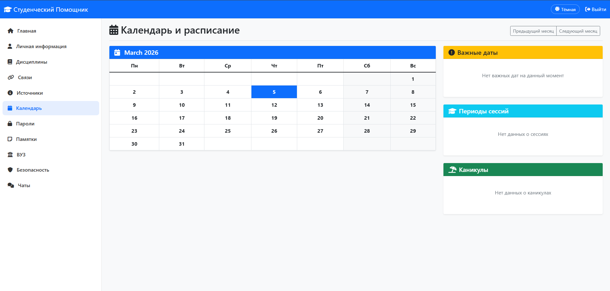
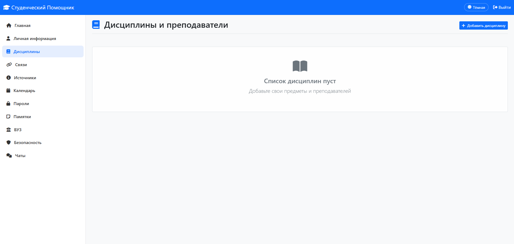
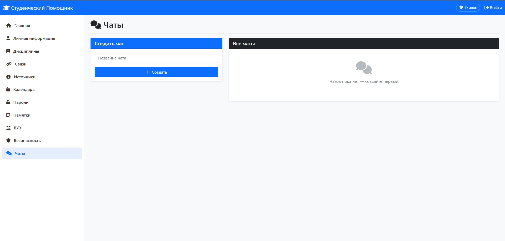
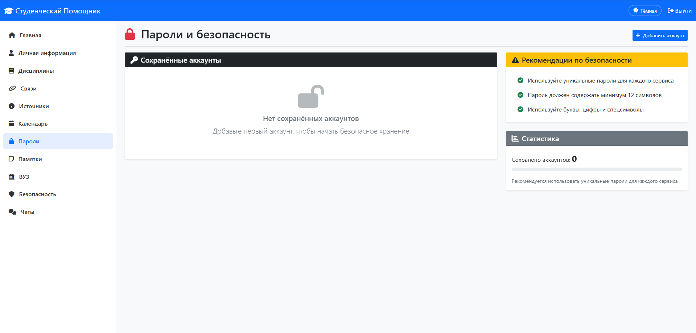

.venv/Scripts/activate 
python manage.py runserver 
daphne -p 8000 config.asgi:application


# 🎓 Студенческий Помощник

> Персональный веб-ассистент для организации учебного процесса студента.  
> Построен на Django 6, поддерживает тёмную тему, real-time чат и полноценное управление данными.

---

## 📸 Скриншоты

| Главная страница | Тёмная тема |
|:---:|:---:|
|  |  |

| Календарь | Дисциплины |
|:---:|:---:|
|  |  |

| Чат | Пароли |
|:---:|:---:|
|  |  |

> 📁 Добавьте скриншоты в папку `screenshots/` в корне проекта

---

## ⚡ Возможности

### 👤 Аккаунты и профиль
- Регистрация и авторизация пользователей
- Личная информация: ФИО, курс, группа, факультет, форма обучения, email, телефон
- Каждый пользователь видит только свои данные

### 📅 Календарь
- Интерактивный календарь с навигацией по месяцам
- Добавление событий кликом по дате
- Типы событий: важная дата, сессия, каникулы, другое
- Боковые виджеты с фильтрацией по типу
- Удаление событий прямо из календаря

### 📚 Дисциплины и преподаватели
- Хранение списка предметов с преподавателями
- Поля: название, преподаватель, курс, часы, успеваемость, оценка, заметки
- Карточный интерфейс с цветовой индикацией оценок

### 🔗 Связи и контакты
- Хранение важных контактов по категориям
- Группировка: одногруппники, преподаватели, деканат и др.

### 📝 Памятки
- Три категории: академические, бытовые, карьерные
- Быстрое добавление и удаление

### 🔒 Пароли и безопасность
- Хранение логинов и паролей от сервисов
- Поля: сервис, логин, пароль, URL, заметки
- Рекомендации по безопасности

### 💬 Real-time чат
- Чат между пользователями через WebSockets (Django Channels)
- Создание тематических комнат
- История сообщений
- Отображение имени отправителя

### 🌙 Тёмная тема
- Переключение светлой/тёмной темы
- Анимированные звёзды в тёмном режиме
- Сохранение выбора в localStorage

### 📊 Дополнительно
- Источники и полезные ссылки
- Информация о ВУЗе
- Адаптивный дизайн (Bootstrap 5)

---

## 🛠 Технологии

| Категория | Стек |
|-----------|------|
| Backend | Python 3.12, Django 6.0 |
| Real-time | Django Channels, WebSockets, Daphne |
| Frontend | Bootstrap 5, Font Awesome, Vanilla JS |
| База данных | SQLite (dev) / PostgreSQL (prod) |
| Аутентификация | Django Auth, кастомная модель User |
| Конфигурация | python-decouple, split settings |

---

## 🚀 Быстрый старт

### Требования

- Python 3.10+
- Git

### 1. Клонировать репозиторий

```bash
git clone https://github.com/Daniil1522-x/StudentAssistent.git
cd StudentAssistent
```

### 2. Создать виртуальное окружение

```bash
python -m venv .venv
```

**Windows:**
```bash
.\.venv\Scripts\Activate.ps1
```

**Linux / macOS:**
```bash
source .venv/bin/activate
```

### 3. Установить зависимости

```bash
pip install -r requirements.txt
```

### 4. Настроить переменные окружения

Создайте файл `.env` в корне проекта:

```env
SECRET_KEY=ваш-секретный-ключ
DEBUG=True
```

Сгенерировать ключ:
```bash
python -c "import secrets; print(secrets.token_urlsafe(50))"
```

### 5. Применить миграции

```bash
python manage.py migrate
```

### 6. Создать суперпользователя (опционально)

```bash
python manage.py createsuperuser
```

### 7. Запустить сервер

**Обычный режим (без WebSocket чата):**
```bash
python manage.py runserver
```

**С поддержкой чата (WebSockets):**
```bash
pip install daphne
daphne -p 8000 config.asgi:application
```

Откройте браузер: [http://127.0.0.1:8000](http://127.0.0.1:8000)

---

## 📁 Структура проекта

```
StudentAssistent/
├── apps/
│   ├── accounts/        # Пользователи и профили
│   ├── calendar_app/    # Календарь и события
│   ├── chat/            # Real-time чат
│   ├── connections/     # Связи и контакты
│   ├── disciplines/     # Дисциплины и преподаватели
│   ├── events/          # Главная страница
│   ├── memos/           # Памятки
│   ├── security/        # Пароли
│   ├── sources/         # Источники
│   └── university/      # Информация о ВУЗе
├── config/
│   ├── settings/
│   │   ├── base.py      # Общие настройки
│   │   ├── dev.py       # Разработка
│   │   └── prod.py      # Продакшен
│   ├── urls.py
│   ├── asgi.py
│   └── wsgi.py
├── templates/           # HTML шаблоны
├── static/              # CSS, JS
├── .env                 # Не в git!
├── .gitignore
├── requirements.txt
└── manage.py
```

---

## ⚙️ Переменные окружения

| Переменная | Описание | Пример |
|-----------|----------|--------|
| `SECRET_KEY` | Секретный ключ Django | `wuv3v03m4zw...` |
| `DEBUG` | Режим отладки | `True` / `False` |

---

## 🔐 Безопасность

- Все данные привязаны к пользователю — чужие данные недоступны
- CSRF защита на всех формах
- Пароли хэшируются Django
- `.env` файл исключён из git
- Debug Toolbar только в режиме разработки

---

## 📋 Roadmap

- [x] Авторизация и регистрация
- [x] Личный профиль
- [x] Календарь с событиями
- [x] Дисциплины и преподаватели
- [x] Памятки по категориям
- [x] Хранение паролей
- [x] Тёмная тема со звёздами
- [x] Real-time чат (WebSockets)
- [ ] Уведомления о событиях
- [ ] Мобильное приложение
- [ ] Экспорт данных в PDF
- [ ] Интеграция с расписанием ВУЗа
- [ ] Двухфакторная аутентификация

---

## 👨‍💻 Автор

**Daniil** — [@Daniil1522-x](https://github.com/Daniil1522-x)

---

## 📄 Лицензия

MIT License — используйте свободно.